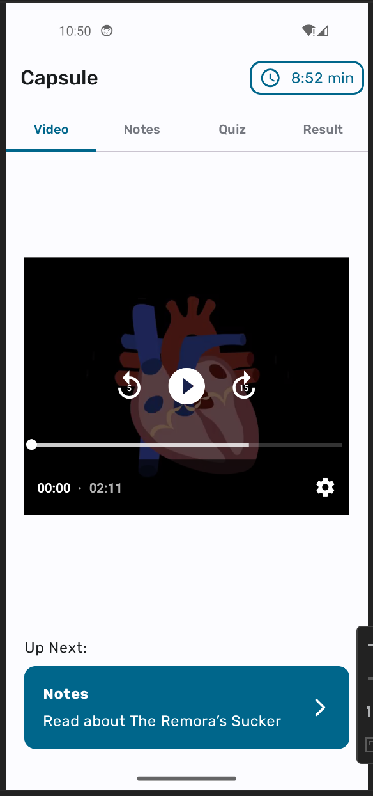
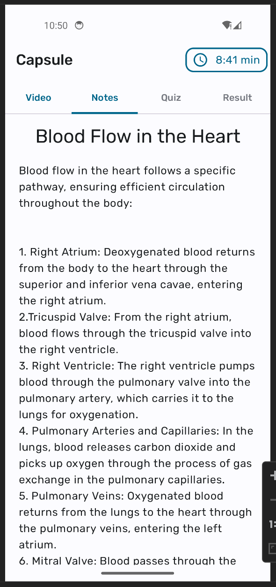
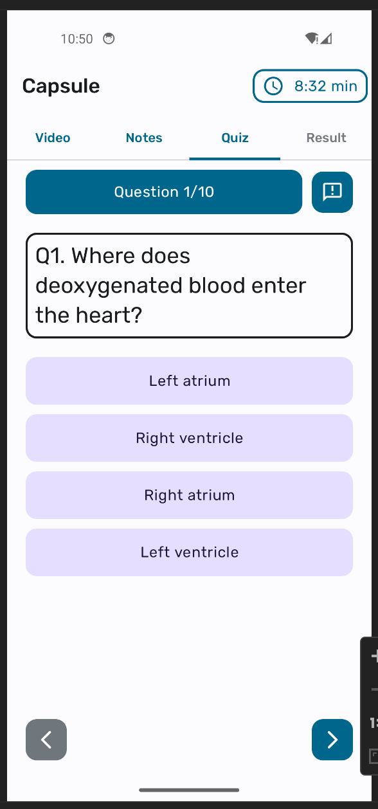
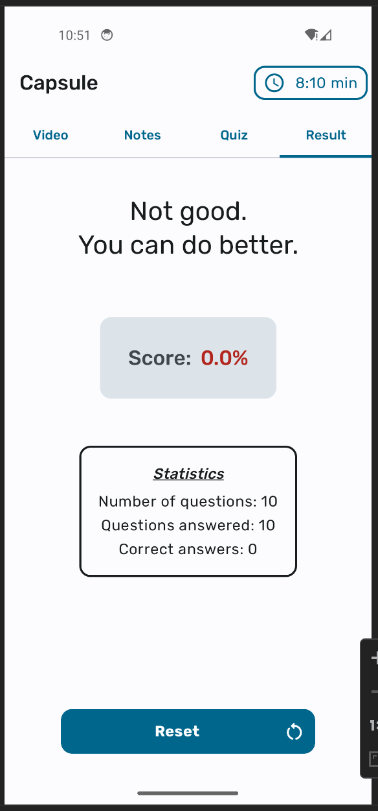

# Capsule Mobile App

Capsule is a mobile application built with Kotlin that presents users with an interactive learning experience. The app follows the MVVM structure with Clean Architecture to ensure scalability and maintainability.

## Features

- **Video Playback:** Users watch an instructional video.
- **Notes Section:** A detailed note follows the video to provide additional insights.
- **Quiz Section:** Users answer questions related to the video, note, or general knowledge.
- **Countdown Timer:** A 10-minute countdown ensures users complete all screens within the given time.
- **Performance Evaluation:** Results are shown after submission or when time runs out.
- **Restart Functionality:** Users can reset and restart the process at any time.

## Screenshots

|:-------------------------:|:-------------------------:|:-------------------------:|:-------------------------:|
|||||
|:-------------------------:|:-------------------------:|:-------------------------:|:-------------------------:|

## Tech Stack

- **Language:** Kotlin
- **Architecture:** MVVM with Clean Architecture
- **UI:** Jetpack Compose / XML (Specify if applicable)
- **Storage:** Room Database (if used) / Shared Preferences
- **Dependency Injection:** Dagger/Hilt (if used)
- **Networking:** Retrofit (if applicable)

## Installation

1. Clone the repository:
   ```bash
   git clone <repository-url>
   ```
2. Open the project in Android Studio.
3. Sync the Gradle files.
4. Build and run the app on an emulator or physical device.

Alternatively, download the APK from the `/apk` folder and install it directly.

## How to Use

1. Launch the app.
2. Watch the video provided.
3. Read the note for additional details.
4. Answer the quiz questions before the 10-minute countdown ends.
5. View your performance summary.
6. Restart if you wish to try again.

## Contributing

Contributions are welcome! Feel free to fork the repository and submit pull requests.

---

Feel free to modify the README based on your project's specifics!

